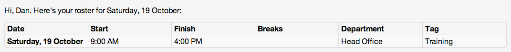

Your [settings page](http://www.payaus.com/settings) gives you control over the functionality of your PayAus system. Use it to configure key aspects of the system, such as the timesheeting algorithm, function. Access the settings page from the menu in the top right corner.

The settings page is split into several categories...

## Timesheets

Configure settings relating to [timesheet](../../timesheets/).

#### Rounding of shifts

Rounding will be applied to the clock-in/out times for staff when their timesheets are updated. This is split in to two different fields, so you can configure different rounding for clock-ins and clock-outs.

When staff clock in, the time of their clock-in will round up, if enabled.

When staff clock out, the time of their clock-out will round down, if enabled.

For example, if both increments are set to **15**, all times on timesheets will appear in 15 minute increments. So, if an employee clocks *in* at 8:50 AM, it will appear on their timesheet as 9:00. If an employee clocks *out* at 5:05 PM, it will appear on their timesheet as 5:00 PM &mdash; if they clock out at 5:23 PM, it will appear as 5:15 PM.

Set these settings to **0 (zero)** to disable them. You are able to enable one but not the other &mdash; for example, you could round clock-ins up in 15 minute increments, but keep clock-outs at their exact time by setting it to 0.

#### Apply shift rounding in aggressive mode

In aggressive mode, shift rounding is applied as described above &mdash; it is called "aggressive" mode because it requires employees to clock in *before* their start time, and clock out *after*, their finish time, if they do not wish to have time docked.

If aggressive mode is disabled, rounding is done to the nearest interval. For example, if rounding of 15 minutes is enabled and someone clocks in at 8:49 AM, it will round down to 8:45 AM, but if they clock in at 8:54 AM it will round up to 9:00 AM.

Aggressive mode is disabled for clock-ins and clock-outs by default. It can be toggled for either category, or both.

#### Round clocked times to rostered times

If enabled, a clock-in or clock-out will have its time rounded to the appropriate rostered time. The appropriate roster is determined using the [shift rounding interval](#rounding_of_shifts) (so you must set that to a number greater than zero, or this rounding will never take effect). For example, if someone is rostered to start work at 9 AM with the rounding interval of 30 minutes:

* A clock in at 8:45 AM or 9:15 AM will be rounded to 9 AM
* A clock in at 8:20 AM or 9:40 AM will *not* be rounded; it will appear on its timesheet as it was clocked

If [aggressive mode](#apply_shift_rounding_in_aggressive_mode) has been enabled, rounding will only be applied aggressively. So in the above example, the 8:45 AM clock-in would be rounded to 9 AM, but the 9:15 AM clock-in would be left as is. The inverse applies for clock-outs.

Rostered time rounding is disabled by default.

#### Maximum shift length

The longest permissible length of a shift, in hours. This is used to determine where one shifts ends and another one finishes, which is used for a variety of calculations. For example, if someone clocks in at 2am, the system checks if this is part of a previous shift (ie. an overnight shift) by using this setting.

The default is **12** hours, but that won't work for all industries. For example, restaurants generally set this to 15 or 16 hours. The exact value will depend on your industry and rostering practices. Be careful when setting this to anything lower than 10 hours as it may break in cases of legitimate overtime.

#### Minimum duration between shifts

Your award should mandate a minimum number of hours between shifts. This setting, in conjunction with the maximum shift length, it is to parse incoming clock-ins and determine if they are part of an existing shift or a new one. This is especially important for overnight shifts.

The default is **10** hours, but check your award and the hours your staff generally work.

#### Tag shifts based on

Every time a timesheet's shift is automatically generated, a tag can be applied to it. This tag may come in handy when exporting data to an accounting system or for reporting purposes. Here you can choose how this tag is applied. The default is to use the name of the time clock that the employee clocked in via (*unless* they used the [employee portal](../../portals/employee)). This data is included when [exporting timesheet data for payroll](../../timesheets/exported).

[Read more about timesheet tags](../../tags/#using_timesheet_tags).

* Name of the time clock used to clock in. Use this if if you manage multiple locations (each with their own time clock) and want to compare costs between locations. It can also be used as a naive method of job tracking, where each time clock is set up as a separate job in your accounting system.
* Name of employee's department. Use this if you have departments representing lines of business and want to compare costs across lines.
* Tag applied to employee's roster. Use this if you want the timesheet tag to match up to the [roster tag](../../tags/#using_roster_tags). For example, if you have lots of locations but only a few time clocks, you can use roster tags to classify locations and have this data copy across to timesheets. If there are no rosters for this shift, no tag will be added (you can add one manually).
* Don't tag shifts automatically. Use this if you do not want automatic tagging applied to your shifts. Note that some accounting packages will raise errors if you try to import tag data that is not recognised. In such cases you can disable this feature by choosing to leave tags blank.

#### Update shift allowances when shifts are edited

You are able to set up [shift allowances](../../payroll/allowances/) to be automated, so that (for example) you can automatically pay staff a bonus when they work between 10pm and midnight. By default, these allowances are updated when staff clock in (using a time clock or other portal), but *not* when you update or approve timesheets via the PayAus website.

If you enable this setting, shift allowances will be automatically updated whenever a timesheet is edited. **Note**: this will make editing timesheets via the site process a little bit slower, but it will ensure that your allowances always match the rules you have configured. This is disabled by default.

#### Enable breaks

If **checked**, a shift will have up to four actions: a start, and break start, a break end, and a finishing time. Breaks will be taken into account when calculating the lengths of shifts and will be [exported](../../timesheets/exporting/) with timesheets.

If **not checked**, a shift will have up to two actions: a start and a finishing time. Breaks will not be taken into account when calculating the lengths of shifts and will not be [exported](../../timesheets/exporting/) with timesheets.

If your staff do not get unpaid lunch breaks (ie. all their breaks are paid) you should disable breaks.

#### Automatic break length

If specified, a break of this length (in minutes) will automatically be applied to shifts which do not otherwise have a break. This is useful if staff have a fixed break reduction applied to their hours, irrespective of if they take a break or not. Breaks are applied to shifts automatically when staff clock in or out, and are [highlighted in orange](../../timesheets/individual/#overriden) on timesheets.

This setting does nothing if [breaks are disabled](#enable_breaks). Set this setting to **0 (zero)** to disable it.

#### Minimum shift length for automatic breaks

If specified, only shifts of this length or longer (in hours) will have an [automatic break length](#automatic_break_length) applied.

Set this setting to **0 (zero)** to disable it. If this is disabled but an automatic break length has been set, the automatic break length will apply to all shifts.

#### Append automatic breaks to clocked breaks

If **enabled**, the automatic breaks you configured above will apply *in addition* to breaks for which your staff clock in or out.

If **disabled**, the automatic breaks you configured above will be overriden by breaks for which your staff clock in or out. This is **disabled by default**.

You can use this setting to simulate two breaks in a shift. For example, in some cases staff will have a fixed, unpaid lunch break, as well as the option of a second (unpaid) break in long shifts. Using this setting you can have the second, clocked, break be added to the first, automatic, break, so that the total break time deducted reflects the two breaks.

#### Employees can edit all timesheet fields

If enabled, employees are able to edit fields such as [shift allowances](../../timesheets/allowances/) and [shift tags](../../payroll/tags/) when vieiwng their timesheets.

If disabled, only [managers and above](../../staff/team/#roles) are able to do so. This is disabled by default.

## Clock-ins

Configure settings relating to *clock-ins* &mdash; the method by which data is entered into timesheets using [portals](../../portals/).

#### Enable mobile clock-in app

Enable the [phone app](../../portals/intro/#phone_app), an alternative method for staff to clock in.

#### Minimum interval between clock-ins

Clock-ins that occur closer together than this number of minutes will be treated as duplicates and handled differently by the timesheet algorithm. This is useful for cases such as:

* Nick clocks out to go on his break
* A co-worker asks Nick to come take a look at something
* Nick clocks back in
* Nick spends 10 minutes looking at this document and providing feedback on it
* Nick clocks out again to actually take his break

In this case, the initial clock out, and subsequent clock in, are ignored. The final clock out (when Nick actually starts his break) are used.

Set this setting to **0 (zero)** to disable it. In this case, no action will be considered a duplicate (all actions will be recorded separately). **5** minutes is a sensible default for most work environments.

## Rosters

#### Categorise roster shifts by department

You can use [tags](../../tags) to freely categorise shifts on rosters. Sometimes you will need to add a second level of categorisation based on a department. Enable this setting (which is disabled by default) to do so.

When this setting is enabled, shifts will automatically be categorised by department, based on the department filters you have applied to the roster. You'll see a message like this at the bottom of your roster to indicate that shifts are being categorised automatically:

Note that a shift is categorised based on the department you are currently viewing. If you don't see the message at the bottom of the roster, ensure that you have filtered your roster by department! If you want to re-categorise a shift into another department, delete it while viewing the department it's in, then re-create it in while vieiwng the department you'd like to move it to.

When you create a shift in this view, it will be linked to a department. Hover over the department's initials to see its full name:

This department is included when sharing rosters with staff:

#### Automatically approve shifts created from rosters

Creating timesheets from rosters is a simple alternative to entering timesheets by hand. When you create timesheets from rosters, this setting determines if these shifts will automatically be approved.

* If enabled, timesheets created from rosters will be approved, so that you can export these timesheets to payroll straight away.
* If disabled, timesheets created from rosters won't be approved. Staff will be able to log in and edit these timesheets (if you have given them site access). You'll need to export the timesheets before exporting to payroll.

This is enabled by default.

## Leave

#### When an employee requests leave, notify...

When staff request [leave](../../timesheets/leave/) (using the [staff leave portal](../../portals/leave/)), you can have PayAus automatically send an email notification. This setting lets you configure who they should be sent to.

* **Organisation admins**: this is the default, see [roles](../../staff/team/#roles) for more info.
* **Employee's department managers**: managers of any [department](../../staff/departments/) the employee requesting leave is in.
* **Organisation admins & employee's department managers**: organisation admins *and* managers of any [department](../../staff/departments/) the employee requesting leave is in.

Leave this blank to not send any email notifications. By default, organisation admins are sent notifications.

## Interface

#### Default Passcode Length

When you go to create a [new team member](../../staff/team), they have a passcode automatically generated for them. You are welcome to change this passcode, but often it's handy to not have to come up with one. The passcode that is generated will be of the length specified here. A length of four is a sensible default for most businesses. If you have a *lot* of staff, or want to make passcodes harder to guess, you should set a longer length.

#### Show weekends on timesheets and rosters

If enabled, weekends will be shown on timesheets and rosters. This is the default

If disabled, Saturdays and Sundays will not show up when viewing a timesheet or roster, unless someone has clocked in on that day.

#### Title of roster "tags" field

The title to use when displaying the [roster tags](../../rosters/tags/) field. This will be used when sending rosters out by email, SMS, or print, as well as being used internally when displaying rosters. You can give it a name that better describes your use for the tag, such as "Location". The default is "Tags".

## Managers

#### Allow managers to see staff costs

If enabled, managers will be able to see staff hourly rates and costs on [timesheets](../../timesheets/), [rosters](../../rosters/), and [staff profiles](../../staff/team/). If disabled, this data will be hidden from managers, and will only be visible to [organisation admins, payroll officers, and roster managers](../../staff/team/#roles). This is enabled by default.

#### Allow managers to share rosters with staff

If enabled, managers are able to send rosters to staff by email or SMS. If disabled, only [organisation admins and roster managers](../../staff/team/#roles) can. This is enabled by default.

#### Allow managers to edit their own timesheets

If enabled, managers are able to update (but not approve) their own timesheets. If disabled, managers can only view their timesheets. This is enabled by default.

## Payroll Settings

### Xero

#### Timesheet tracking category name

If you have set up [payroll tracking categories](http://help.xero.com/help/PayrollCategory.htm#Tsheets) in Xero, you will need to enter the name of the tracking category you are using here. For example, in the image below, you would enter "Job" as the tracking category name.

#### Timesheet default tracking option

When you set up a [tracking category](http://help.xero.com/help/Settings_Tracking.htm#BK_SetUpCategory) in Xero, you create one or more options for that category. Here you should enter the default tracking option. When PayAus exports your timesheets to Xero, it uses the shift's [tag](../../tags/#using_timesheet_tags) to attempt to match to a tracking category option. If it is not able to match one, the default option is used.

This is important because you cannot import timesheets into Xero without entering a tracking category option if you have enabled timesheet tracking (just as you cannot create a timesheet manually without one in that case). Therefore, make sure that the option you enter here is one of the options available for the tracking category you entered above.

### Talent2

#### Client ID

The Talent2 export format requires a Client ID, which identifies your organisation to Talent2 payroll processing. Contact your Talent2 account manager to get your Client ID. It should be five characters, eg "PA674".